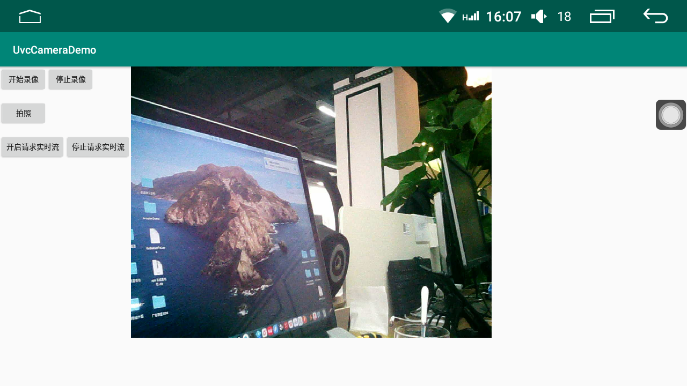

UvcCameraDemo
===================================
 
Introduction
------------
* Android App,Android Studio工程;
* 基于开源的uvc so库(https://github.com/saki4510t/UVCCamera),具有拍照、录像、获取实时流的基本功能;

Screenshots
-------------

 

License
-------
该项目fork自Android的相机开发大佬York，地址：https://github.com/yorkZJC
感谢该作者此项目对我工作中解决触摸屏外接相机采集图像的帮助！！！

